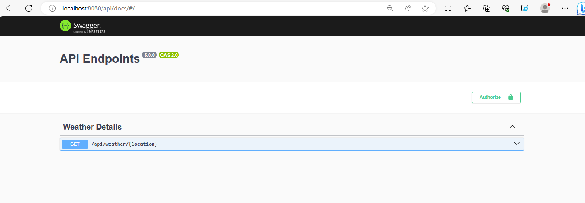

# IDE Weather Backend 

> *A backend project * 

## Table of Contents

* [Technologies Used](#technologies-used)
* [Features](#features)
* [Getting Started](#getting-started)
* [Screenshots](#screenshots)
* [API Usage](#api-usage)

## Technologies Used
- Node js
- Express js
- swagger (api documentation)


## Features

Ready features used:
- Get weather data based on user location
- Yet to integrate a weather api

## Getting Started

To get started with this project, follow these steps:

1. Clone the repository to your local machine:

   ```
   git clone https://github.com/BM-Daniel/ide-weather-dashboard.git
   ```

2. Navigate into the project directory:

   ```
   cd `backend``
   ```

3. Install the project dependencies:

   ```
   npm install
   ```

4. Start the development server:

   ```
   npm start
   ```

5. Open your browser:

   ```
   Go to http://localhost:8080/api/docs/
   ```
   
## Screenshots
- 

## API Usage

1. Get user weather details:

   ```
   - Click on /api/weather/{location}
   - Click on try it out
   - Enter user location
   - Click on execute
   - Check response body for final message
   ```

2. Other apis to come
   
